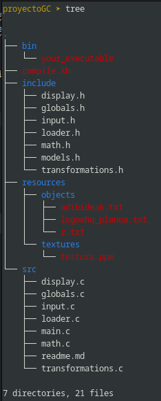

# Graphics Engine
## Description
This is a simple graphics engine that I made for a university project. It uses OpenGL and GLFW to render 3D objects. It 
loads models from a .txt file and renders them. Textures can be applied to the models.

## Features
- Load models from a '.txt' file
- Draw either individual triangles or entire models.
- Apply textures to triangle/models using UV mapping
- Translate and rotate models using local and global reference systems

## How to use
1. Clone the repository
```
git clone git@github.com:Matx1n3/graphicsEngine_GC.git
cd graphicsEngine_GC
```
2. Compile and run the project
```
chmod +x compile.sh
./compile.sh
```

## Controls
| Key   | Action |
|-------|--------|
| ESC   | Exit the program.|
| TAB   | Switch to the next object in the scene.|
| ENTER | Switch to the next triangle in the current object.
| f     | Load a new object from a file.
| l     | Toggle filling of triangles.
| o	    | Toggle treating objects as a whole.
| d	    | Toggle drawing all objects.
| t	    | Set transformation mode to TRANSLATE.
| r	    | Set transformation mode to ROTATE.
| g     | Toggle reference system between LOCAL and GLOBAL.
| x/X   | Translate/Rotate along the X-axis.
| y/Y   | Translate/Rotate along the Y-axis.
| z/Z   | Translate/Rotate along the Z-axis.

## Configuration
Some configurations can be changed in the 'globals.h' and 'globals.c' files. Refer to the comments 
in the files for more information.

## Structure


## Conclusion
Despite being a simple graphics renderer, it serves as a base for more complex projects.
It can be used as a starting point for adding more features.