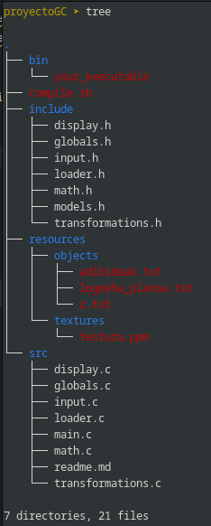

# Graphics Engine
## Descripción
Este es un motor gráfico simple que hice para un proyecto universitario. Utiliza OpenGL y GLFW para renderizar objetos 3D. Él
carga modelos desde un archivo .txt y los renderiza. Se pueden aplicar texturas a los modelos.

## Características
- Cargar modelos desde un archivo '.txt'
- Dibuja triángulos individuales o modelos completos.
- Aplicar texturas a triángulos/modelos usando mapeo UV
- Traducir y rotar modelos utilizando sistemas de referencia locales y globales.

## Cómo utilizar
1. Clonar el repositorio
```
git clone git@github.com:Matx1n3/graphicsEngine_GC.git
cd graphicsEngine_GC
```
2. Compile y ejecute el proyecto.
```
chmod +x compile.sh
./compile.sh
```

## Controles
| Clave | Acción                                               |
|-------|------------------------------------------------------|
| ESC   | Salir del programa.                                  |
| TAB   | Cambiar al siguiente objeto de la escena.            |
| INTRO | Cambiar al siguiente triángulo en el objeto actual.   
| f     | Cargar un nuevo objeto desde un archivo.             
| l     | Poner/quitar textura.                      
| o     | Alternar el tratamiento objeto/triangulo. 
| d     | Alternar dibujo de todos los objetos/triangulos.                
| t     | Establecer el modo de transformación a MOVER.    
| r     | Establecer el modo de transformación a GIRAR.       
| g     | Alternar sistema de referencia entre LOCAL y GLOBAL. 
| x/X   | Mover/Rotar a lo largo del eje X.                 
| y/Y   | Mover/Rotar a lo largo del eje Y.                 
| z/Z   | Mover/Rotar a lo largo del eje Z.                 

## Configuración
Se pueden cambiar algunas configuraciones en los archivos 'globals.h' y 'globals.c'.
Consulte los archivos para más información.

## Estructura


## Conclusión
A pesar de ser un renderizador de gráficos sencillo, sirve como base para proyectos más complejos.
Se puede utilizar como punto de partida para agregar más funcionalidades.